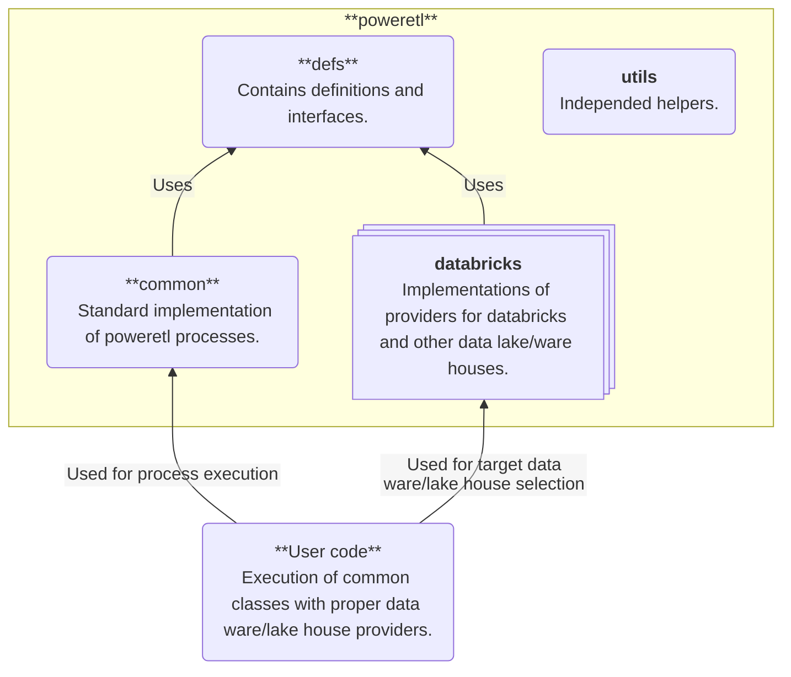

# Overview
**poweretl** is library to support *etl* processes and tasks. 

# High Level Design

| Package                       | Description 
| ----------------------------- | --------------------------------------------------------------- |
| **poweretl.utils**            | Independent package for tools. |
| **poweretl.defs**             | Definition of data classes used to communication between providers and executors. Contains also interfaces for providers. |
| **poweretl.common**           | Implementation of processes (executors). |
| **poweretl.databricks**       | Implementation of providers for databricks. |

Examples of usage can be find in poweretl repostiory, project - *examples* folder *tests* (implemented as tests).

