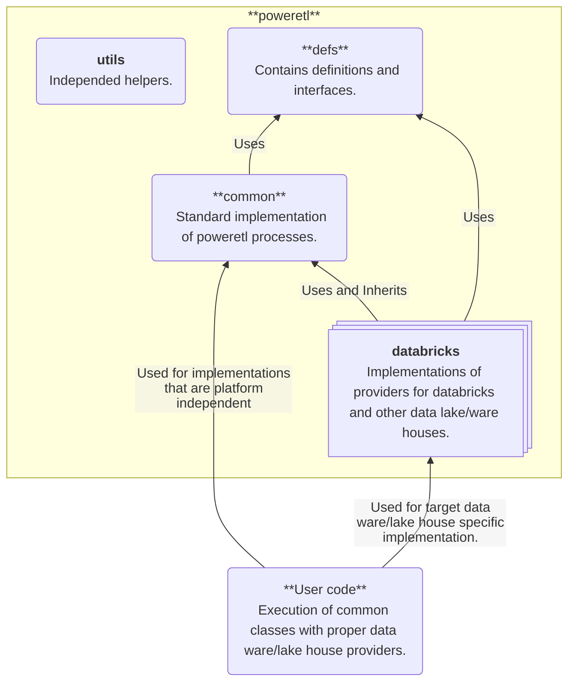

# Overview
**poweretl** is library to support database, data warehouse/lakehouse python projects. It is build a way to allow constructor dependency injection for own customizations and extensions.

# Naming convention
In this project follow names are used in context:

- Model: definition of database structure (e.g. tables, views)
- Meta: metadata, e.g. for Model it contains information about it's deployment state
- Provider: an object that provides some resources and functions that are finally used by managers
- Manager: a final object that do the desired job (e.g. provision Model to database)

# Features
Currently library provides following features:

 - Define a database model based on definition stored in yaml or json files
 - Parametrize database model based on definition stored in yaml or json files
 - Provision and update database model to target database/warehouse/lakehouse
  

# High Level Design
Library is designed in a way to allow easy extension. Following list and graph show main role of target packages. Examples of library usage can be find in [Examples](examples/).

| Package                             | Description 
| ----------------------------------- | --------------------------------------------------------------- |
| [poweretl.utils](utils)             | Independent package for helper tools. |
| [poweretl.defs](defs)               | Definition of data classes used to communication between providers and managers. Contains also interfaces for providers. It provides abstraction that allows to work with different kinds of storages and databases. |
| [poweretl.common](common)           | General implementation of providers and managers. |
| [poweretl.databricks](databricks)   | Implementation of providers and managers for databricks. |

